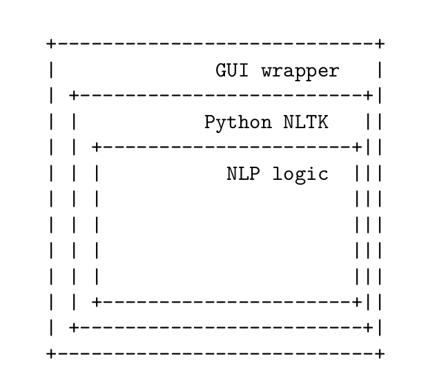

I am on the side of the makers. I believe that the humanities can be a place
not just to think about things, but to do things. Doing, when done right, can
expand the scope of our critical activity, it can prepare our students for work
in the world, and finally, (and this despite the protestations of some)[^1]
doing can enact meaningful change in our universities, our libraries, and our
communities. I write, then, being inspired by the research being done in
institutions like the Critical Making Lab at University of Toronto, Concept Lab
at UC Irvine, and metaLab at Harvard, along with many similar research centers
that routinely engage with material culture as a matter of scholarly practice.
Besides reading, discussing, and writing papers, students enrolled in my
courses create models, curate exhibitions, file patents, convene conferences,
write grant applications, send letters to the senate, draw, build, and code.

Understood in the context of the university at large, the digital humanities
(DH) are a part of the "computational turn" altering the course of all major
disciplines: see computational biology, computational linguistics,
computational social science, computational chemistry, and so on.  In general
agreement with Geoffrey Rockwell, Stephen Ramsey,[^2] and William J.
Turkel[^3] among others, I believe that programming offers new and promising
avenues for the advancement of the humanities: tools and methods that
supplement the traditional research activities of a historian, a literary
scholar, or a philosopher.[^ln-dh] But, in this essay, I would like to bring
into question a specific mode of tool making, practiced within the digital
humanities and beyond, of the sort that confuses tools with methods. More
perniciously, the kind of tools I have in mind prevent or tacitly discourage
critical engagement with methodology. To be clear: much work remains to be done
in the area of improving humanities infrastructure. The care of sites and
archives that facilitate collaboration within our community is not in question
here. Rather, I am concerned with research tools that offer the promise of easy
insight.

To put the question into a more acute form, I ask: Can research and tool-making
ever be practiced apart from each other, in any field? Imagine a group of
astronomers using a telescope that reveals wondrous far-away star
constellations. Yet, our hypothetical scientists do not know if these stars are
real, or whether they are an artifact of the telescope. This, in short, has
always been a tool-wielder's dilemma. Contemporary research instrumentation in
our field, from natural language processing to network analysis, involves
complex mechanisms. Their inner workings often lie beyond the full
comprehension of a casual user. Received insight becomes suspect when tools
wielders fail to comprehend their tools. To use tools well, we must, in some
real sense, know them better than the tool makers. At the very least, the
researcher using a tool should understand it well enough to know its biases and
limitations.

The best kind of tools are the ones that we make ourselves. After spending days
at wrangling a particularly messy corpus, I might write a script that automates
data wrangling. The code may function to strip extraneous HTML code, for
example. I could then release it as a software library to help others who face
the same task. With time, I may add a graphical user interface or build a web
service. Such small acts of kindness lift all boats. They accelerate the
research capabilities of the field as a whole. I would do nothing to discourage
such altruistic sharing. But let us make sure that in using such tools we also
do not forget to master them from inside out. What if my code implicitly
mangles important metadata or worse yet, what if it alters the primary sources
in an unexpected and tendentious ways?

As tool makers, let us also not forget the lessons of numerous forgotten
projects, of the sort that did not find an audience or failed to make an
impact. And let us ask, why? For every line of code running Pandoc, NLTK, and
Zotero there are thousands of abandoned lines, which nevertheless represent the
hard work and aspiration of many talented individuals. Even in failure (by
conventional standards) these projects can teach us something about the way we
work.[^7] Much can be learned from them, but only if we take the time to
carefully analyze our mistakes. I present here the lessons I took from some of
my own failed projects. Fundamentally, I have come to believe that the
university is an unfit place to develop "big" software. We are much better
placed to remain agile: to tinker and to experiment. I offer the following from
an incomplete list as to the reasons why:

1. Some tools encourage intellectual laziness by obscuring methodology. More
often, it is not the tool but rather a mode of lazy thinking at fault. For
example: the (very useful) *nltk.cluster* module bundled in Python's Natural
Language Toolkit (NLTK) framework[^9] contains an implementation of something
called "k-means clustering," used to discover similar documents in a
collection.[^10] The algorithm is numerical, unsupervised, non-deterministic
and iterative.[^11] To use it well we need to have a way of estimating a number
of expected clusters (that's the *k* variable). The algorithm produces
non-hierarchical results and being non-deterministic, the clusters will vary
with each iteration. Both the E-M and the GAA clusterers, also included in the
module, could be better suited for the task at hand. But how to decide which?
If none of the above makes sense to you, it did not to me either, until
recently. Getting to the reasoning behind the tool involved reading the
framework documentation, stepping through the code, and learning about the
algorithms involved.[^ln-stat] NLTK facilitates such discovery through
meticulous notes, published at nltk.org.

[^ln-stat]: found in *Foundations of Statistical Natural Language
Processing* by Christopher D. Manning and Hinrich Schütze.

I took at least two lessons from exploring NLTK: first, about empowered use.
Although I was able to start experimenting with the framework in a matter of
days, it took me months to understand the logic beneath, and I am still
learning. The second is about documentation. NLTK is particularly good at
revealing its methods. The code base is open to inspection. It is easy to read
and well documented. And it contains many links to the related research.
Throughout, steps were taken to expose the encoded assumptions. Clearly,
immense care went into the critical apparatus that surrounds the tool. And I
suspect that at this, late stage, of the project's life cycle, more overall
hours went into the maintenance of documentation than into the crafting of
code. The NLTK GitHub page lists no fewer than 130 contributors to the overall
effort. My own modest data munging library would need much work to reach that
level of excellence.

Note that NLTK itself is a wrapper around a set of statistical approaches
(models and methods) to the study of natural language. That step of
encapsulation already poses a number of problems for research. To use NLTK
responsibly requires some statistical literacy along with the ability to
examine the implemented code. Yet higher level encapsulations of NLTK (like a
web-based topic modeler, for example) would further remove the user from the
logic. Each layer of abstraction introduces its own set of assumptions,
compromises, and complexity. The resulting (hypothetical) web application may
look easy to use. Yet, paradoxically, the ease would be gained at the expense
of added (and hidden) complexity.

Hidden complexity puts the user in danger of resembling those hapless
astronomers who receive wondrous pictures from broken telescopes. To avoid
falling into such a trap, in the way of actual astronomers, we would have learn
to disassemble the device, gaining access to those inner-most meaning-making
mechanisms. There are no other logical ways to make the tool simpler. Any
attempt to repackage it further only adds another layer of obfuscation.

Consequently, out-of-the-box tools are easy to adopt initially, but may be a
poor investment of time in the long run. Methodologies improve over time.
Tools proliferate and decline in quality relative to the researcher's
experience. Reviewing the academic literature on k-means clustering at its
lowest "raw" level of abstraction initially could be a tedious and
labor-intensive affair. Not being a statistician, I cannot always follow the
math. But, in looking at a number of articles in several related fields I am
able to understand the uses and the limitations of the algorithm. This
knowledge is independent of implementation. If tomorrow's researchers move from
Python to Haskell (for example), the applied methods will transfer with the
language. The method is what lasts, not the implementation.

Getting to the methodological layer of the tool can be initially expensive, but
ultimately, it makes for a more durable investment of time. Gaining fluency in
widely-adopted languages, like R or Python, enables us to reach a wider
audience: to share expertise, to seek and to offer support, and to share
findings with a diverse community of practitioners. To learn some custom and
curtailed version of those languages actually prevents conversation.

2. Software is easy (cheap and fun) to build relative to the difficulty
(expense and drudgery) of maintenance. "90% of coding is debugging. The other
10% is writing bugs."[^8] This aphorism comes naturally to program managers and
software engineers who have gone through the full product development cycle.
In the excitement of building new tools, it is easy to underestimate the
challenges of long-term maintenance. Academic attention spans are naturally
cyclical: articles are published, interest wanes, funding dries up, students
graduate. We start anew each semester. Software is linear. It requires the
continuity of care and much more of it as code matures. Standards change,
dependencies break, platforms decay, users have questions. The case for the
humanities as a laboratory for innovation is strong, but I doubt that anyone is
prepared to make "critical customer support" a part of our teaching or research
experience. Most departments, labs, libraries, and institutes are therefore not
well equipped to deal with the vagrancies of long-term software maintenance.

In fact, if you build it, they might not come at all. Startups know that beyond
the initial excitement of a product launch, the challenge of any new app or web
service is acquiring and retaining users, no matter how "disruptive" or
"innovative" the technology. A few years a go, I spent quite a bit of time
working with a talented French developer on the next generation of a
distributed (crowd-sourced) translation service. Despite his skills and
dedication to the project, the tool did not gain significant traction among
translators or language students. No amount of innovative engineering or web
design guarantees participation. Neither of us had the time nor the resources
needed to advocate for the service. This would require training, outreach, and
support that we could not provide to the community in addition to our
professional obligations.

It is however tempting to think that social or institutional change can be
enacted through software alone. Consider the following: every contemporary
Macintosh laptop comes prepackaged with powerful command line tools for text
manipulation like `wc,` `sort`, and `uniq`. Together they can be used to count
and sort words in a document or to generate a term frequency distribution,
useful for formal text analysis.

These small utilities are free, simple to learn, versatile, and require no
additional installation. They come with their own textbook, built into the
terminal.[^ln-moby] Yet most of my students, even at the intermediate level,
use their own machines at a fraction of their capacity. Many were not exposed
to the basics of file structure or operating system essentials. This gives me
pause, particularly when someone proposes to add complexity. What would be the
use (again hypothetically) of yet another term frequency distribution tool when
the existing ones languish from disuse and lack of training? Any alternative
project duplicating the functionality of the built-in "word count" (`wc`) for
example, would have to do better in some regard as to capability, ease of use,
and ubiquity. And even then, it would face exactly the same challenge of
training and adaption. Furthermore, whatever adaption it would achieve, would
risk fracturing the already small user base. The `wc` users would strain to
peer review papers from the other camp, until the new tool is similarly well
understood.

By analogy, a new publishing platform that hopes to "disrupt" academic
knowledge production, cannot autonomously solve the problems of the current
publishing regime (of the kind Kathleen Fitzpatrick highlights in *Planned
Obsolescence*).[ln2-kathleen] The difficulty lies in convincing our peers to
read and to write differently. It is in the way we cite, in our program
requirements, and in the way train faculty, students, and librarians. The tool
comprises a small part of a much larger ecosystem. It can be a wedge that
initiates change, but not without a much larger communal enterprise, which must
also include training, support, and outreach.

[^ln-moby]: If you are behind one of these machines now, search for your
terminal application using Spotlight and type `man wc` in the prompt (`q` to
exit). For mere examples see:
https://github.com/xpmethod/dhnotes/blob/master/command-line/109-text.md

The effort to shift the habitus of a community involves a delicate balance
between disruption and continuance. Much can be learned from the success of the
open source and free culture movements in this regard.[^12] Take for example
the story of *Wikipedia* and *MediaWiki*. *MediaWiki*, the software platform
powering *Wikipedia*, was neither the first, nor the most technically
sophisticated wiki software package. But in the hands of Wikipedians, it became
something capable of transforming the contemporary information landscape.
Wikipedia struck the right balance between traditional forms of
knowledge-making (the encyclopedia) and innovative editorial structures
(commons-based peer production).[^13] I am therefore inspired by *Wikipedia*
the community, not *MediaWiki* the tool.

The emphasis on community practice leads us to standards and best practices.
Rather than more tools, we need initiatives that promote methodological and not
just instrumental innovation: humanities-based alternatives to associations
like the *Society for Political Methodology and the International Association
of Legal Methodology*; journals like *Sociological Methods & Research*,
*Journal of Mixed Methods Research*, *International Journal of Qualitative
Methods*; prizes and funding opportunities like the *Political Methodology
Career Achievement and Emerging Scholars Awards*, or the *Program for Promoting
Methodological Innovation in Humanities and Social Sciences* run by the Japan
Society for the Promotion of Science. To sharpen our tools we must return to
methodology: to formulate common questions, to take it more seriously in our
training, and to give it more room in our debates and publications. Where
possible, we should congeal our practice around a common set of tools and
platforms that have wide adaption and that answer to the values of humanistic
critical inquiry.

DH cannot survive alone, in isolation from similar movements in other fields.
The concern with data processing and computation, the availability of large
datasets and cheap processing power have brought a number of disciplines closer
together, in a way that elicits much intellectual excitement. But to actually
make fireworks together, we need to operate the same incendiary equipment. That
is to say that finding strings within the human genome could have some
interesting applications to mining the *Gutenberg Project* and the other way
around. Biologists, linguists, economists, and sociologists increasingly
integrate their methodologies, as evidenced by a vigorous cross-disciplinary
publishing record. The computational turn sweeping all forms of knowledge is
enabled by common toolsets, by collective methodological assumptions, and
through shared standards of academic exposition (clarity, concision, and
reproducibility).[^14] DH is primed to join that conversation, but only if its
conceptual apparatus does not evolve in isolation. Working as a digital
humanist or a new media scholar means taking on extra responsibilities: to do
well by theory when doing theory, to be expert librarians when building
archives, to build things that last when building things, and to do good
science when doing science.

[^1]: See: Fish, Stanley. *Save the World on Your Own Time*. Oxford
    University Press, USA, 2008.

[^2]: Ramsay, Stephen, and Geoffrey Rockwell. “Developing Things: Notes
    toward an Epistemology of Building in the Digital Humanities.” In
    *Debates in the Digital Humanities*, ed. Matthew Gold. Minneapolis:
    Univ Of Minnesota Press, 2012.

[^3]: See for example: Elliott, D, R MacDougall, and W.J Turkel. “New
    Old Things: Fabrication, Physical Computing, and Experiment in
    Historical Practice.” *Canadian Journal of Communication* 37, no. 1
    (2012): 121–128.

[^4]: See, for example, Fish, Stanley. “Mind Your P’s and B’s: The Digital
Humanities and Interpretation.” *The New York Times Opinionator*. Accessed
December 14, 2012.
http://opinionator.blogs.nytimes.com/2012/01/23/mind-your-ps-and-bs-the-digital-humanities-and-interpretation/.

[^5]: See Unsworth, John. “Scholarly Primitives: What Methods Do
    Humanities Researchers Have in Common, and How Might Our Tools
    Reflect This?” King’s College, London, 2000 as part of part of a
    symposium on Humanities Computing: Formal Methods, Experimental
    Practice.
    http://people.lis.illinois.edu/\~unsworth//Kings.5-00/primitives.html.

[^6]: http://www.neh.gov/divisions/odh/grant-news/videos-2012-digital-humanities-start-grantees

[^7]: William Pannapacker has written eloquently on the topic in the
    Chronicle of Higher Education. See “Pannapacker From MLA: The
    Success of ‘Failure’” *The Chronicle of Higher Education*. From the
    Archives: Brainstorm, January 7, 2011.
    http://chronicle.com/blogs/brainstorm/pannapacker-from-mla-failure-is-the-new-normal/30864.

[^8]: The quote is commonly attributed to Bram Cohen, the creator of
    BitTorrent, posted on tweeter.com in 2011. There are however
    numerous earlier instances of the exact quote, itself a variation of
    Sturgeon's Law coined by Theodore Sturgeon (the American science
    fiction writer) in a 1957 article for *Venture* magazine and cited
    as such in the Oxford English Dictionary.

[^9]: Bird, Steven, Ewan Klein, and Edward Loper. *Natural language
    processing with Python*. Cambridge [Mass.]: O’Reilly, 2009.

[^10]: MacQueen, J. “Some Methods for Classification and Analysis of
    Multivariate Observations.” In *Proc. Fifth Berkeley Sympos. Math.
    Statist. and Probability* (Berkeley, Calif., 1965/66), Vol. I:
    Statistics, pp. 281–297. Berkeley, Calif.: Univ. California Press,
    1967. http://www.ams.org/mathscinet-getitem?mr=0214227.

[^11]: Na, Shi, Liu Xumin, and Guan Yong. “Research on K-means
    Clustering Algorithm: An Improved K-means Clustering Algorithm.” In
    2*010 Third International Symposium on Intelligent Information
    Technology and Security Informatics* (IITSI), 63 –67, 2010.

[^12]: See for example Weber, Steven. *The Success of Open Source*.
    Harvard University Press, 2005.

[^13]: A point made by Benjamin Mako Hill in his *Almost Wikipedia: What
    eight early online collaborative encyclopedia projects reveal about
    the mechanisms of collective action*, summarized in a recent talk at
    the Berkman Center for Internet and Society, abstract and
    transcripts available at
    http://cyber.law.harvard.edu/events/luncheon/2011/10/makohill.
    Another good summary by Garber, Megan. “The Contribution Conundrum:
    Why Did Wikipedia Succeed While Other Encyclopedias Failed?” Nieman
    Journalism Lab. Accessed December 22, 2012.
    http://www.niemanlab.org/2011/10/the-contribution-conundrum-why-did-wikipedia-succeed-while-other-encyclopedias-failed/.

[^14]: Witness the communities aroudn arxiv.org and PLOS ONE.

[^ln-dh]: I do not mean to imply that DH can be *reduced* to computation.

[ln2-kathleen]:
